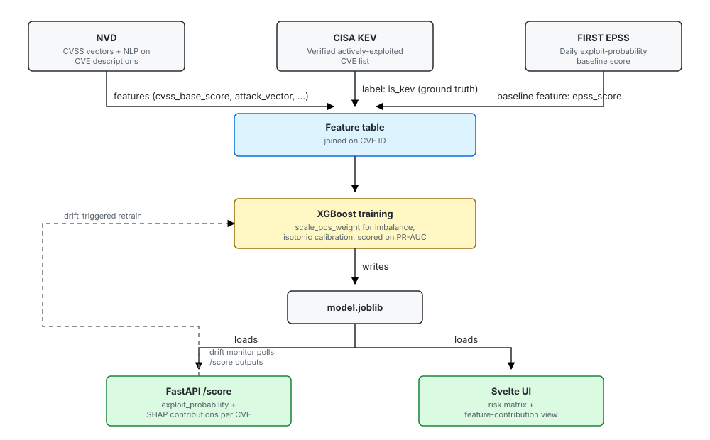

# AI-Assisted Vulnerability Risk Prioritization

Predictive probability model for vulnerability triage — replaces static CVSS severity heuristics with a calibrated `P(Exploit | Features)` estimate.

See [`PROJECT_PLAN.md`](./PROJECT_PLAN.md) for the problem statement, architecture, and roadmap, and [`DATA_SOURCES.md`](./DATA_SOURCES.md) for the three data sources (NVD, CISA KEV, FIRST EPSS) and how they join.

## Architecture



## Layout

```
src/
  ingestion/   # NVD, CISA KEV, FIRST EPSS API clients
  features/    # joins the three sources into a training table
  model/       # XGBoost training, calibrated for PR-AUC on imbalanced data
  api/         # FastAPI inference endpoint with SHAP explanations
data/
  raw/         # pulled API responses, untouched
  processed/   # joined feature tables (parquet)
notebooks/     # exploratory analysis
tests/
```

## Quick start

```bash
pip install -r requirements.txt
python -m src.ingestion.nvd_client   # sanity-check NVD access
python -m src.ingestion.kev_client   # sanity-check CISA KEV feed
python -m src.ingestion.epss_client  # sanity-check FIRST EPSS API
```
